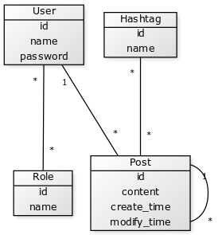

## Tietokantakaavio



## CREATE TABLE -lauseet

```
CREATE TABLE hashtag (
	id INTEGER NOT NULL, 
	name VARCHAR(40) NOT NULL, 
	PRIMARY KEY (id), 
	UNIQUE (name)
)
```

```
CREATE TABLE account (
	id INTEGER NOT NULL, 
	name VARCHAR(20) NOT NULL, 
	password VARCHAR(50) NOT NULL, 
	PRIMARY KEY (id)
)
```

```
CREATE TABLE role (
	id INTEGER NOT NULL, 
	name VARCHAR(20) NOT NULL, 
	PRIMARY KEY (id), 
	UNIQUE (name)
)
```

```
CREATE TABLE post (
	id INTEGER NOT NULL, 
	parent_id INTEGER, 
	create_time DATETIME NOT NULL, 
	modify_time DATETIME NOT NULL, 
	user_id INTEGER NOT NULL, 
	content VARCHAR(3000) NOT NULL, 
	PRIMARY KEY (id), 
	FOREIGN KEY(parent_id) REFERENCES post (id), 
	FOREIGN KEY(user_id) REFERENCES account (id)
)
```

```
CREATE TABLE user_role (
	user_id INTEGER, 
	role_id INTEGER, 
	FOREIGN KEY(user_id) REFERENCES account (id), 
	FOREIGN KEY(role_id) REFERENCES role (id)
)
```

```
CREATE TABLE post_hashtag (
	post_id INTEGER, 
	hashtag_id INTEGER, 
	FOREIGN KEY(post_id) REFERENCES post (id), 
	FOREIGN KEY(hashtag_id) REFERENCES hashtag (id)
)
```

## Indeksoinnit

`Account` -taulussa on indeksoinnit `name` ja `password` kentille.

## Normalisointi

Tietokanta on normalisoitu, sillä kaikki sen taulut ovat kolmannessa normaalimuodossa. Mitkään 
sarakkeet eivät ole listoja ja sarakkeiden arvot ovat samaa tyyppiä. Tietokantaan ei tallenneta 
samanlaisia rivejä eikä sarakkeiden tai rivien järjestys vaikuta tietokannan toimintaan. 
Jokaisessa taulussa on vain yksi pääavain ja kaikkien muiden sarakkeiden arvot ovat 
funktionaalisesti riippuvaisia vain tästä pääavaimesta.
